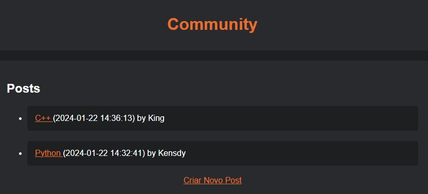
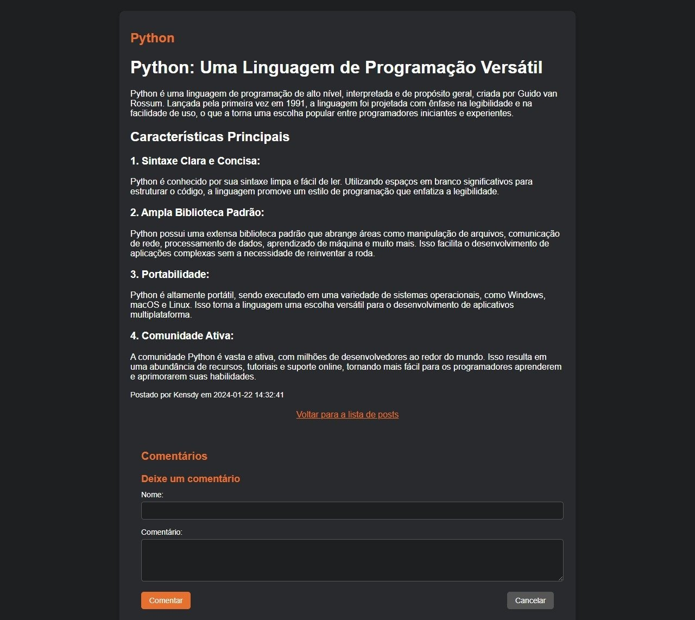
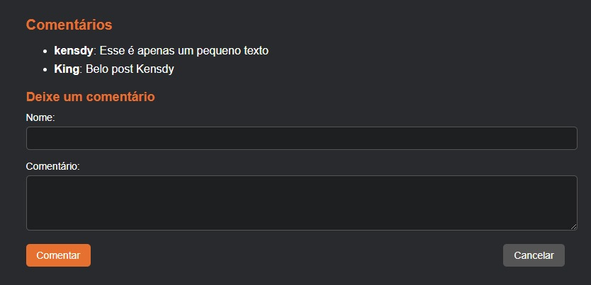

# Community - Flask Forum Template

[Português](README_pt.md) | English

[](https://github.com/kensdy/Community)

Community is a forum template developed in Flask, providing a simple and open structure for implementing online discussion systems. This project is open source and can be easily customized to meet the specific needs of different online communities.

## Features

- **Posts and Comments:** Users can create posts and interact through comments, providing a dynamic discussion experience.

- **No Login System:** By default, Community does not have a login system. This simplifies access but also means that user identity is not verified.

- **No Database:** This template does not use a database to store posts or comments. Keep in mind that, upon restarting the server, all posts will be lost.

## How to Use

1. **Prerequisites:**
   - Ensure that you have Python installed on your machine.

2. **Cloning the Repository:**
   - Run the following command to clone the repository:
     ```bash
     git clone https://github.com/kensdy/Community
     ```
3. **Running the Application:**
   - Navigate to the newly cloned directory with `cd Community`.
   - Install dependencies using `pip install -r requirements.txt`.
   - Run `python main.py` to start the local server.
   - Access `http://127.0.0.1:5000` in your browser to interact with the forum.

4. **Customization:**
   - Adapt the source code to meet your specific needs.
   - Consider implementing a login system or integrating with a database if necessary.

## Video Tutorial

Check out this video tutorial demonstrating installation and providing an overview of Community. The video includes:

- Step-by-step instructions for installing Community.
- A brief demonstration of key features.

[](https://www.youtube.com/watch?v=j09MK7o5NCU)

## Site Images

### Home Page



### Post Page



### Comments Page



## Contributions

Contributions are welcome! If you want to improve Community, feel free to open issues or submit pull requests.

## License

This project is licensed under the [MIT License](LICENSE) - see the LICENSE file for more details.

## Acknowledgments

Thank you for using Community. We hope it serves as a useful starting point for your online forum implementations.
